# YASB Modern Glass Theme

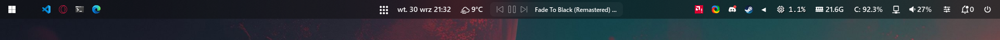

A sleek Windows 11 customization theme featuring modern glass aesthetics with transparency effects, blur, and rounded corners. This theme transforms your Windows taskbar into a beautiful, translucent interface with customizable widgets and smooth animations.

## Features

- **Glass Effect**: Translucent taskbar with blur effects and acrylic styling
- **Modern Widgets**: Clock, weather, system monitoring, media player, volume control, and more
- **System Monitoring**: CPU, memory, disk usage, and network traffic widgets
- **Audio Control**: Volume control with device selection menu
- **Launchpad**: Quick app launcher with custom icons

## Installation

1. **Prerequisites**: Install YASB Reborn https://github.com/amnweb/yasb
2. **Fonts**: Install `"Segoe UI"`, `"JetBrainsMono NFP"` and `"Segoe Fluent Icons"` if you don't have it.
2. **Install theme**: Copy `config/yasb/config.yaml` and `config/yasb/styles.css` to yasb config directory.
5. **Restart YASB**: Reload YASB to apply the new theme

## Gallery

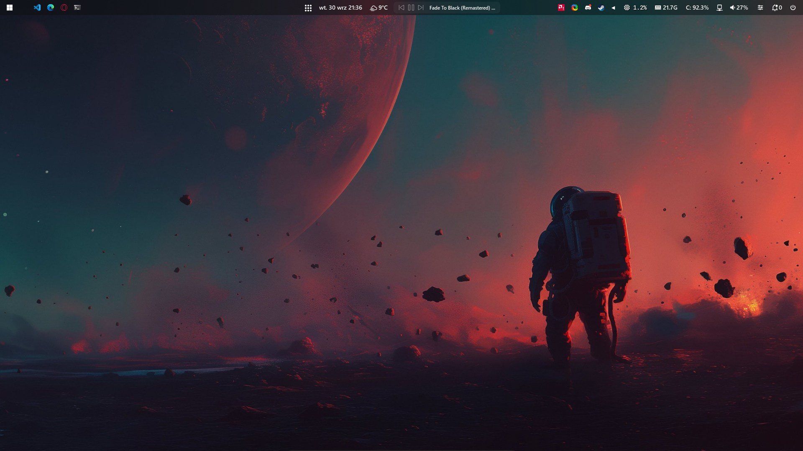

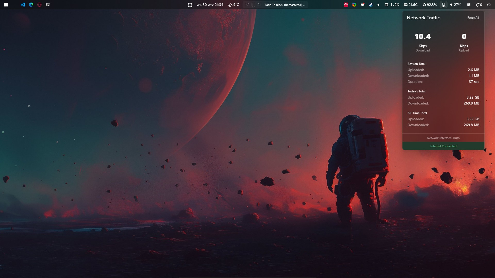

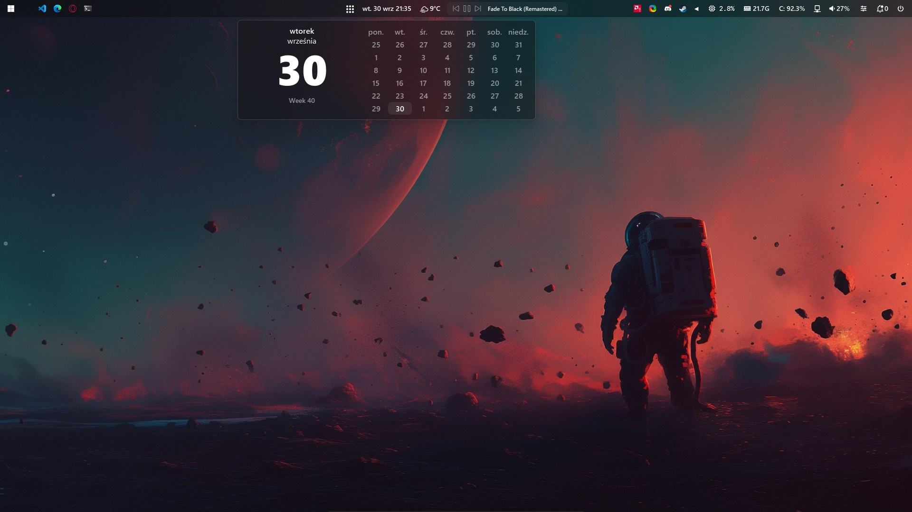

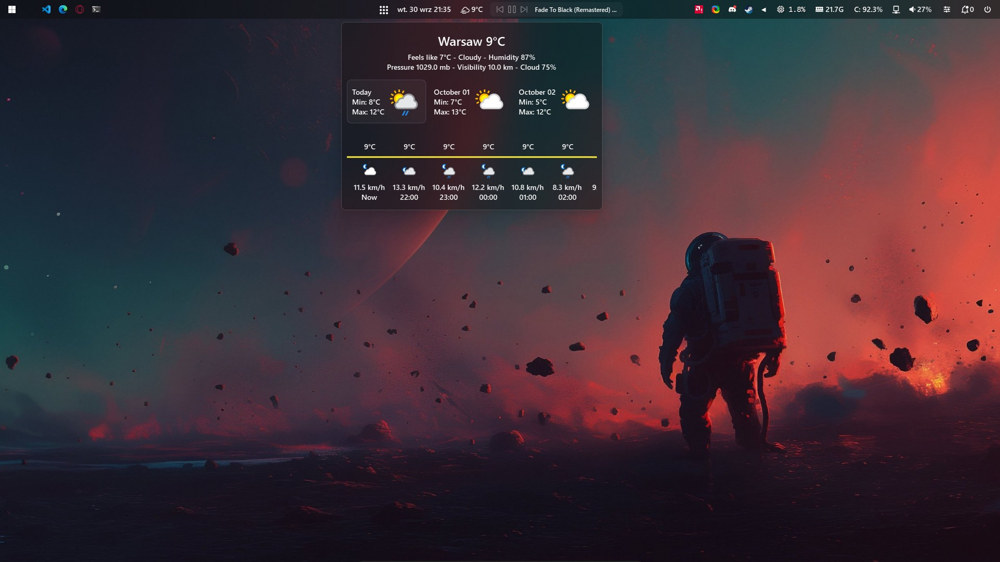

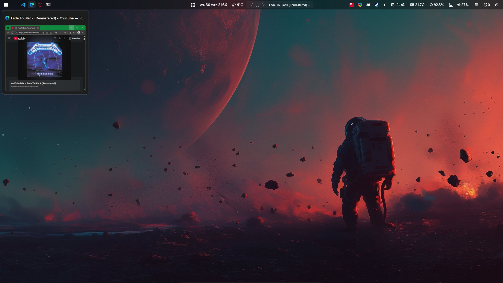

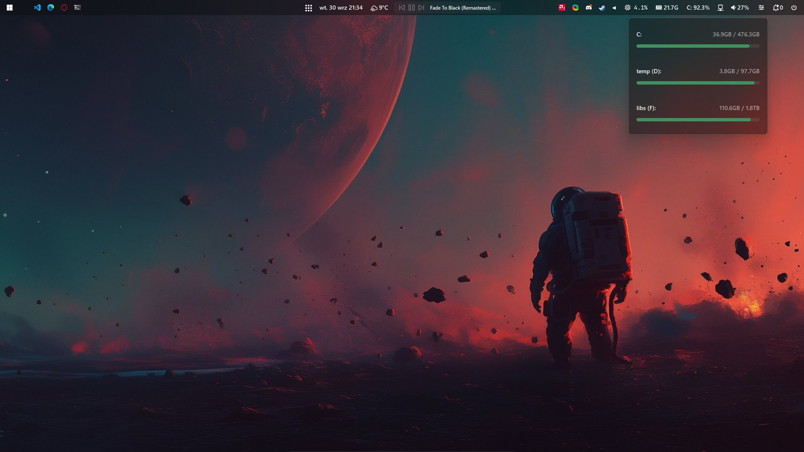

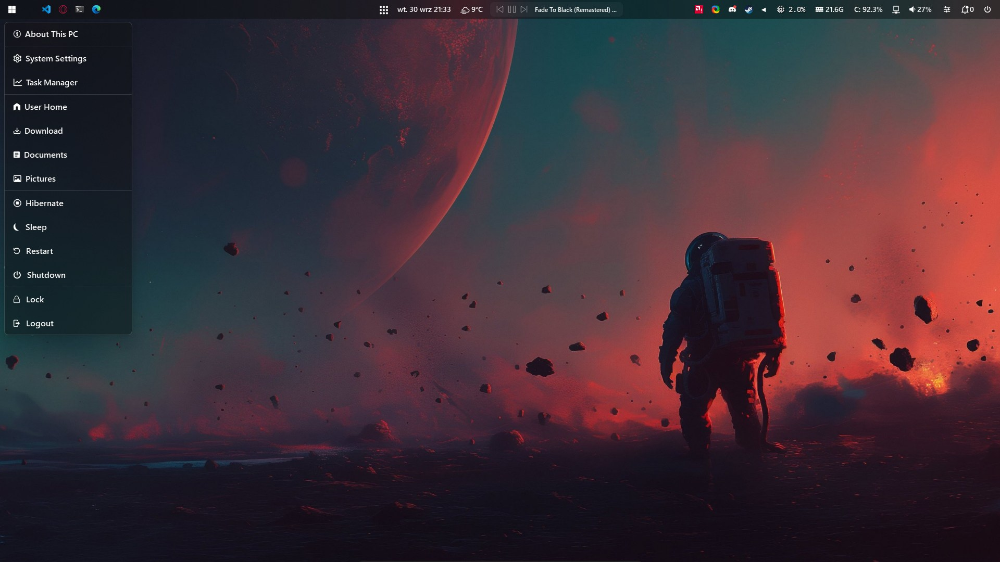

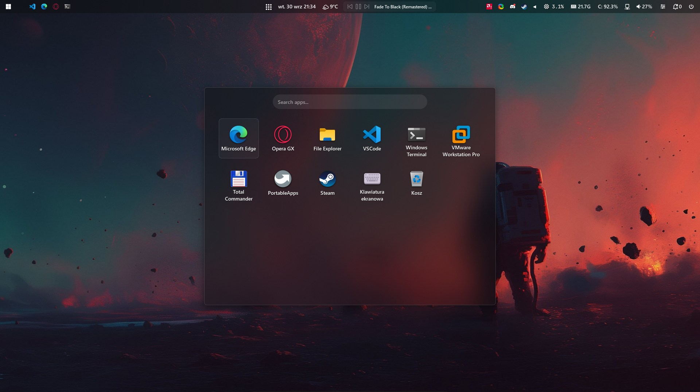

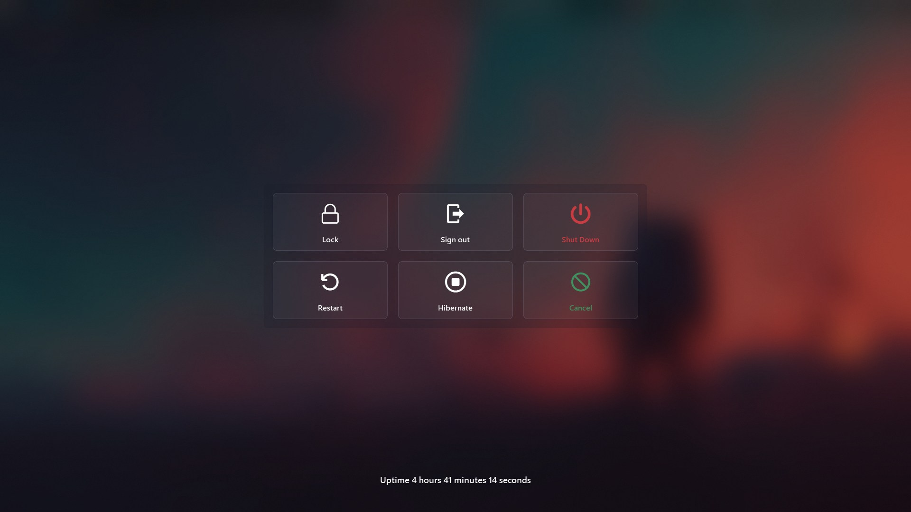

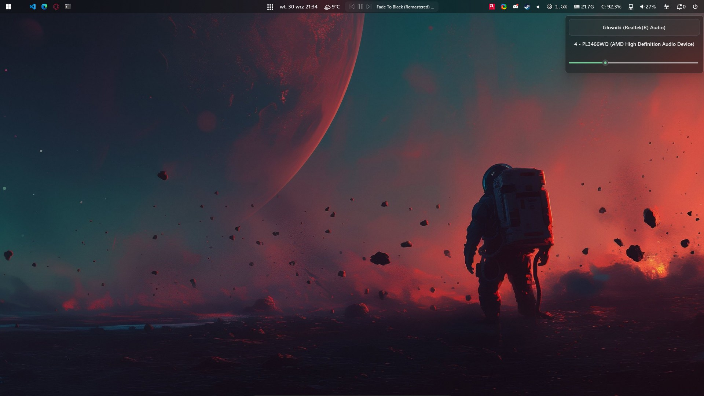

## Author
